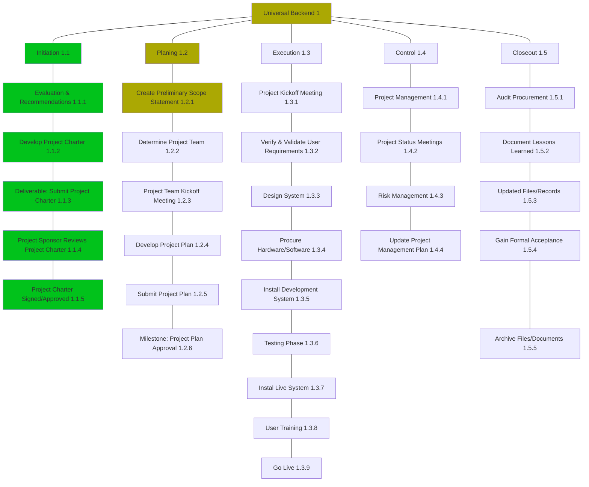

# Work Breakdown Structure
Date:  2022-03-01 17:24

The WBS is a view into the project that illustrates the work the project encompasses. The Project Manager and project team use the WBS to develop the project schedule, resource requirements, and costs. There are many ways you can present the WBS for your project; this template provides some of the popular layouts from which you can choose. Different layouts may be more suitable for different purposes (presentations vs. plan documentation, for example). 
In order to save space in this template we only developed the WBS examples down to the third level. In your project you may want to develop them further.
Note: Instructions for what to include in each section appear in gold italics.

## Contents
* [Outline View](#Outline_View)
* Hierarchical Structure
* Tabular View
* Tree Structure View
* WBS Dictionary
* Glossary of Terms

##  Outline View
The outline view presents an easy to view and understand layout for the WBS. It is also a good layout to use when developing the WBS because you can easily make changes, especially since the Microsoft Word auto numbering feature updates the WBS Code automatically.

            

1. Widget Management System

	1.1. Initiation

	*	1.1.1. Evaluation & Recommendations

	*	1.1.2. Develop Project Charter

	*	1.1.3. _Deliverable:_ Submit Project Charter

	*	1.1.4. Project Sponsor Reviews Project Charter

	*	1.1.5. Project Charter Signed/Approved

	1.2. Planning

	*	1.2.1. Create Preliminary Scope Statement

	*	1.2.2. Determine Project Team

	*	1.2.3. Project Team Kickoff Meeting

	*	1.2.4. Develop Project Plan

	*	1.2.5. Submit Project Plan

	*	1.2.6. _Milestone:_ Project Plan Approval

	1.3. Execution

	*	1.3.1. Project Kickoff Meeting

	*	1.3.2. Verify & Validate User Requirements

	*	1.3.3. Design System

	*	1.3.4. Procure Hardware/Software

	*	1.3.5. Install Development System

	*	1.3.6. Testing Phase

	*	1.3.7. Install Live System

	*	1.3.8. User Training

	*	1.3.9. Go Live

	1.4. Control

		1.4.1. Project Management
		
		1.4.2. Project Status Meetings
		
		1.4.3. Risk Management
		
		1.4.4. Update Project Management Plan

	1.5. Closeout

		1.5.1. Audit Procurement
		
		1.5.2. Document Lessons Learned
		
		1.5.3. Update Files/Records
		
		1.5.4. Gain Formal Acceptance
		
		1.5.5. Archive Files/Documents

## Hierarchical Structure
The hierarchal structure is similar to the outline view but without indentation. Although this format is more difficult to read, it may be useful where you have many levels and indenting each level would make the table too large to fit into a document.

| Level | WBS Code | Element Name                            |
| ----- | -------- | --------------------------------------- |
| 1     | 1        | Widget Management System                |
| 2     | 1.1      | Initiation                              |
| 3     | 1.1.1    | Evaluation & Recommendations            |
| 3     | 1.1.2    | Develop Project Charter                 |
| 3     | 1.1.3    | Deliverable: Submit Project Charter     |
| 3     | 1.1.4    | Project Sponsor Reviews Project Charter |
| 3     | 1.1.5    | Project Charter Signed/Approved         |
| 2     | 1.2      | Planning                                |
| 3     | 1.2.1    | Create Preliminary Scope Statement      |
| 3     | 1.2.2    | Determine Project Team                  |
| 3     | 1.2.3    | Project Team Kickoff Meeting            |
| 3     | 1.2.4    | Develop Project Plan                    |
| 3     | 1.2.5    | Submit Project Plan                     |
| 3     | 1.2.6    | Milestone: Project Plan Approval        |
| 2     | 1.3      | Execution                               |
| 3     | 1.3.1    | Project Kickoff Meeting                 |
| 3     | 1.3.2    | Verify & Validate User Requirements     |
| 3     | 1.3.3    | Design System                           |
| 3     | 1.3.4    | Procure Hardware/Software               |
| 3     | 1.3.5    | Install Development System              |
| 3     | 1.3.6    | Testing Phase                           |
| 3     | 1.3.7    | Install Live System                     |
| 3     | 1.3.8    | User Training                           |
| 3     | 1.3.9    | Go Live                                 |
| 2     | 1.4      | Control                                 |
| 3     | 1.4.1    | Project Management                      |
| 3     | 1.4.2    | Project Status Meetings                 |
| 3     | 1.4.3    | Risk Management                         |
| 3     | 1.4.4    | Update Project Management Plan          |
| 2     | 1.5      | Closeout                                |
| 3     | 1.5.1    | Audit Procurement                       |
| 3     | 1.5.2    | Document Lessons Learned                |
| 3     | 1.5.3    | Update Files/Records                    |
| 3     | 1.5.4    | Gain Formal Acceptance                  |
| 3     | 1.5.5    | Archive Files/Documents                 |

 
## Tabular View
The Tabular View is a nicely organized table view of the WBS. It is a good option for organizations which prefer table formats.

| Level 1                     | Level 2         | Level 3                                       |
| --------------------------- | --------------- | --------------------------------------------- |
| 1  Widget Management System | 1.1  Initiation | 1.1.1 Evaluation & Recommendations            |
|                             |                 | 1.1.2 Develop Project Charter                 |
|                             |                 | 1.1.3 Deliverable: Submit Project Charter     |
|                             |                 | 1.1.4 Project Sponsor Reviews Project Charter |
|                             |                 | 1.1.5 Project Charter Signed/Approved         | 
|                             | 1.2  Planning   | 1.2.1 Create Preliminary Scope Statement      |
|                             |                 | 1.2.2 Determine Project Team                  |
|                             |                 | 1.2.3 Project Team Kickoff Meeting            |
|                             |                 | 1.2.4 Develop Project Plan                    |
|                             |                 | 1.2.5 Submit Project Plan                     |
|                             |                 | 1.2.6 Milestone: Project Plan Approval        |
|                             | 1.3  Execution  | 1.3.1 Project Kickoff Meeting                 |
|                             |                 | 1.3.2 Verify & Validate User Requirements     |
|                             |                 | 1.3.3 Design System                           |
|                             |                 | 1.3.4 Procure Hardware/Software               |
|                             |                 | 1.3.5 Install Development System              |
|                             |                 | 1.3.6 Testing Phase                           |
|                             |                 | 1.3.7 Install Live System                     |
|                             |                 | 1.3.8 User Training                           |
|                             |                 | 1.3.9 Go Live                                 |
|                             | 1.4  Control    | 1.4.1 Project Management                      |
|                             |                 | 1.4.2 Project Status Meetings                 |
|                             |                 | 1.4.3 Risk Management                         |
|                             |                 | 1.4.4 Update Project Management Plan          |
|                             | 1.5  Closeout   | 1.5.1 Audit Procurement                       |
|                             |                 | 1.5.2 Document Lessons Learned                |
|                             |                 | 1.5.3 Update Files/Records                    |
|                             |                 | 1.5.4 Gain Formal Acceptance                  |
|                             |                 | 1.5.5 Archive Files/Documents                 |

## Tree Structure View
The Tree Structure View is the most popular format for the WBS. It presents an easy to understand view into the WBS; however, it is also tricky to create without an application specifically designed for creating this organizational chart structure. The Tree Structure below was created using only Microsoft Word and the SmartArt graphics option under the insert menu. Microsoft Visio is also useful for creating this view.

## WBS Dictionary
The WBS Dictionary contains all the details of the WBS which are necessary to successfully complete the project. Most importantly it contains a definition of each Work Package which can be thought of as a mini scope statement. Resources on the project will look at the WBS dictionary to determine the scope of the Work Package they've been assigned, so it's important to be clear when writing the definition.

| Level | WBS Code | Element Name                            | Definition                                                                                                                                                                    |
| ----- | -------- | --------------------------------------- | ----------------------------------------------------------------------------------------------------------------------------------------------------------------------------- |
| 1     | 1        | Widget Management System                | All work to implement a new widget management system.                                                                                                                         |
| 2     | 1.1      | Initiation                              | The work to initiate the project.                                                                                                                                             |
| 3     | 1.1.2    | Develop Project Charter                 | Project Manager to develop the Project Charter.                                                                                                                               |
| 3     | 1.1.4    | Project Sponsor Reviews Project Charter | Project sponsor reviews the Project Charter.                                                                                                                                  |
| 3     | 1.1.5    | Project Charter Signed/Approved         | The Project Sponsor signs the Project Charter which authorizes the Project Manager to move to the Planning Process.                                                           |
| 2     | 1.2      | Planning                                | The work for the planning process for the project.                                                                                                                            |
| 3     | 1.2.1    | Create Preliminary Scope Statement      | Project Manager creates a Preliminary Scope Statement.                                                                                                                        |
| 3     | 1.2.2    | Determine Project Team                  | The Project Manager determines the project team and requests the resources.                                                                                                   |
| 3     | 1.2.3    | Project Team Kickoff Meeting            | The planning process is officially started with a project kickoff meeting which includes the Project Manager, Project Team and Project Sponsor (optional).                    |
| 3     | 1.2.4    | Develop Project Plan                    | Under the direction of the Project Manager the team develops the project plan.                                                                                                |
| 3     | 1.2.5    | Submit Project Plan                     | Project Manager submits the project plan for approval.                                                                                                                        |
| 3     | 1.2.6    | Milestone: Project Plan Approval        | The project plan is approved and the Project Manager has permission to proceed to execute the project according to the project plan.                                          |
| 2     | 1.3      | Execution                               | Work involved to execute the project.                                                                                                                                         |
| 3     | 1.3.1    | Project Kickoff Meeting                 | Project Manager conducts a formal kick off meeting with the project team, project stakeholders and project sponsor.                                                           |
| 3     | 1.3.2    | Verify & Validate User Requirements     | The original user requirements is reviewed by the project manager and team, then validated with the users/stakeholders. This is where additional clarification may be needed. |
| 3     | 1.3.3    | Design System                           | The technical resources design the new widget management system.                                                                                                              |
| 3     | 1.3.4    | Procure Hardware/Software               | The procurement of all hardware, software and facility needs for the project.                                                                                                 |
| 3     | 1.3.6    | Testing Phase                           | The system is tested with a select set of users.                                                                                                                              |
| 3     | 1.3.7    | Install Live System                     | The actual system is installed and configured.                                                                                                                                |
| 3     | 1.3.8    | User Training                           | All users are provided with a four hours training class.  Additionally, managers are provided with an additional two hours class to cover advanced reporting.                 |
| 3     | 1.3.9    | Go Live                                 | System goes live with all users.                                                                                                                                              |
| 2     | 1.4      | Control                                 | The work involved for the control process of the project.                                                                                                                     |
| 3     | 1.4.1    | Project Management                      | Overall project management for the project.                                                                                                                                   |
| 3     | 1.4.2    | Project Status Meetings                 | Weekly team status meetings.                                                                                                                                                  |
| 3     | 1.4.3    | Risk Management                         | Risk management efforts as defined in the Risk Management Plan.                                                                                                               |
| 2     | 1.5      | Closeout                                | The work to close-out the project.                                                                                                                                            |
| 3     | 1.5.1    | Audit Procurement                       | An audit of all hardware and software procured for the project, ensures that all procured products are accounted for and in the asset management system.                      |
| 3     | 1.5.2    | Document Lessons Learned                | Project Manager along with the project team performs a lessons learned meeting and documents the lessons learned for the project.                                             |
| 3     | 1.5.3    | Update Files/Records                    | All files and records are updated to reflect the widget management system.                                                                                                    |
| 3     | 1.5.4    | Gain Formal Acceptance                  | The Project Sponsor formally accepts the project by signing the acceptance document included in the project plan.                                                             |

## Glossary of Terms
It's important that you provide a glossary of terms as some of the terms are not understood by persons without a project management background.	             

Level of Effort: Level of Effort (LOE) is how much work is required to complete a task.

WBS Code: A unique identifier assigned to each element in a Work Breakdown Structure for the purpose of designating the elements hierarchical location within the WBS.

Work Package: A Work Package is a deliverable or work component at the lowest level of its WBS branch.

WBS Component: A component of a WBS which is located at any level. It can be a Work Package or a WBS Element as there's no restriction on what a WBS Component is.

WBS Element: A WBS Element is a single WBS component and its associated attributes located anywhere within a WBS. A WBS Element can contain work, or it can contain other WBS Elements or Work Packages.

---
