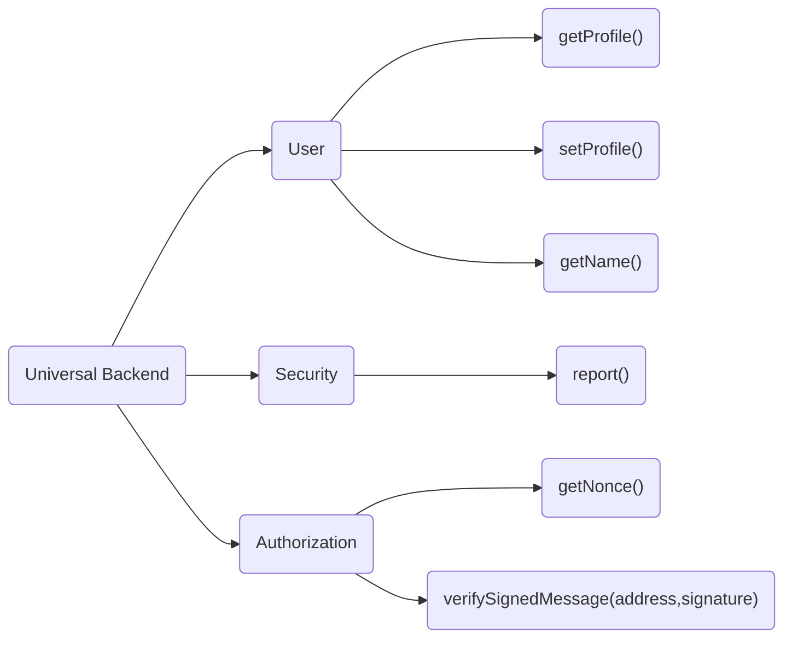
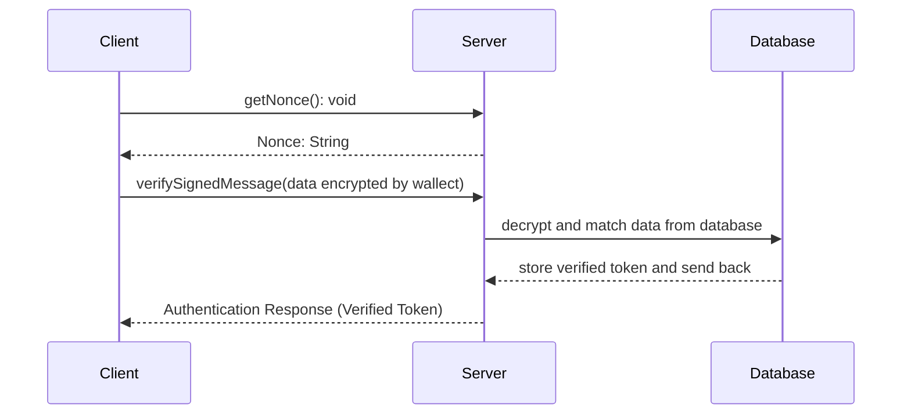

# Functional Design
Date:  2022-02-17 21:36


## 1. Functional Design


## 1.1 API Status


## 2. API
### 2.1. Authorization
	API for who connected wallet to store extra info to the server.
	Authorization for any user activity required server 




#### 2.1.1 getNonce
	Fetch verify data for wallet sign with the key.
* Request URI
	*  `{apiAddress}/getNonce`
*  Request Method
	* GET
* Request Parameter
	* None
*  Respond
```json
	{
		nonce: number
	}
```
#### 2.1.2 verifySignedMessage
	Submit signed message to firebase.
* Request URI
	*  `{apiAddress}/verifySignedMessage`
* Request Method
	*  POST
*  Request Parameter

| name      | required | type   | instruction         |
| --------- | -------- | ------ | ------------------- |
| address   | Yes      | String | Account address     |
| signature | Yes      | String | Signed from  wallet |

```json
	{
		address: "account address",
		signature: 
	}
```
*  Respond
```json
	{
		token: 'firebase auth token'
	}
```

### 2.2. Profile
#### 2.2.1 setProfile
	Set up user profile
* Request Function
```dart
	 
	 FirebaseDatabase.instance.ref("users/"+ address).set({"name": name,
"email": email})
	 
```
* Request Method
	*  Firebase SDK
*  Respond

#### 2.2.2 getProfile
	Fetch user profile
* Request Function (sample)
```dart

	 FirebaseDatabase.instance.ref("users/"+ address).once()
	
```
* Request Method
	* Firebase SDK
*  Respond
```json
	{
		"name": "John",
		"email": "111@gmail",
	}
```


---