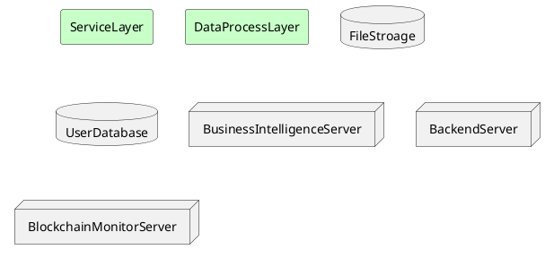
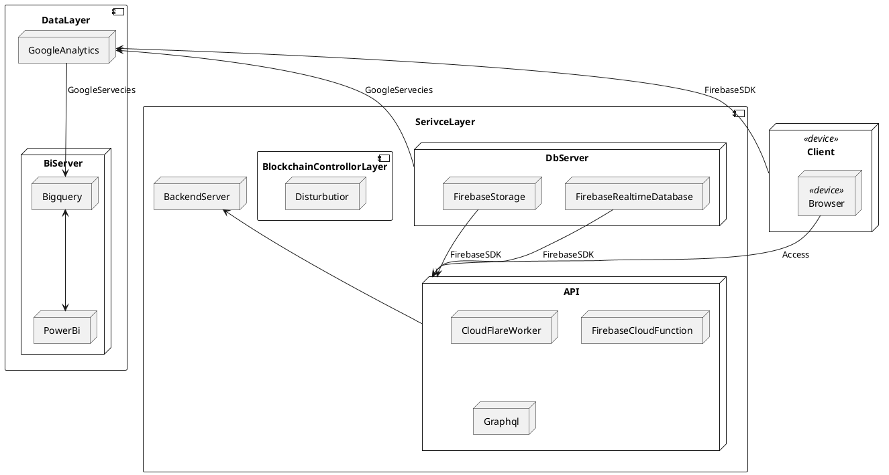

# Deployment Document
Date:  2022-02-11 20:54

## 1. Architecture

* Blockchain Monitor Server
	* Web hook
* Backend Server
	* Serverless
	* Backend
* Database Server
	* File Storage
	* NoSQL
* Business Intelligence Server

## 2. Deployment Diagram

Sample:

## 3.  Service Purchase Options
*	Static Page Hosting Server
	* Firebase Hosting
	* Netlify 
	*  VPS Hosting
*  Backend Server
	* Serverless
		* CloudFlare Worker 
		* Firebase Cloud Function 
		* VPS Hosting
	* Backend
		* VPS Hosting
* Database Server
	* File Storage
		* Firebase Storage
	* NoSQL
		* Firebase Realtime Database
		* MongoDB (cloud)
		* VPS Hosting
* Blockchain Monitor Server
	* [Openzeppelin Autotask]  (https://defender.openzeppelin.com/#/autotask)
	* [Moralis Webhooks] (https://docs.moralis.io/moralis-server/cloud-code/webhooks)
	* VPS Hosting
*  Data Science System
	* Bigquery
	* Google Analytics
	* PowerBi

## 4. Prices
 
| name                       | price               |
| -------------------------- | ------------------- |
| Static Page Hosting        |                     |
| VPS                        |                     |
| CloudFlare Worker          |                     |
| Firebase Cloud Function    |                     |
| Firebase Storage           |                     |
| Firebase Realtime Database |                     |
| Blockchain Control System  | node *  price / per |
| Bigquery                   |                     |
| Google Analytics           | free                |

